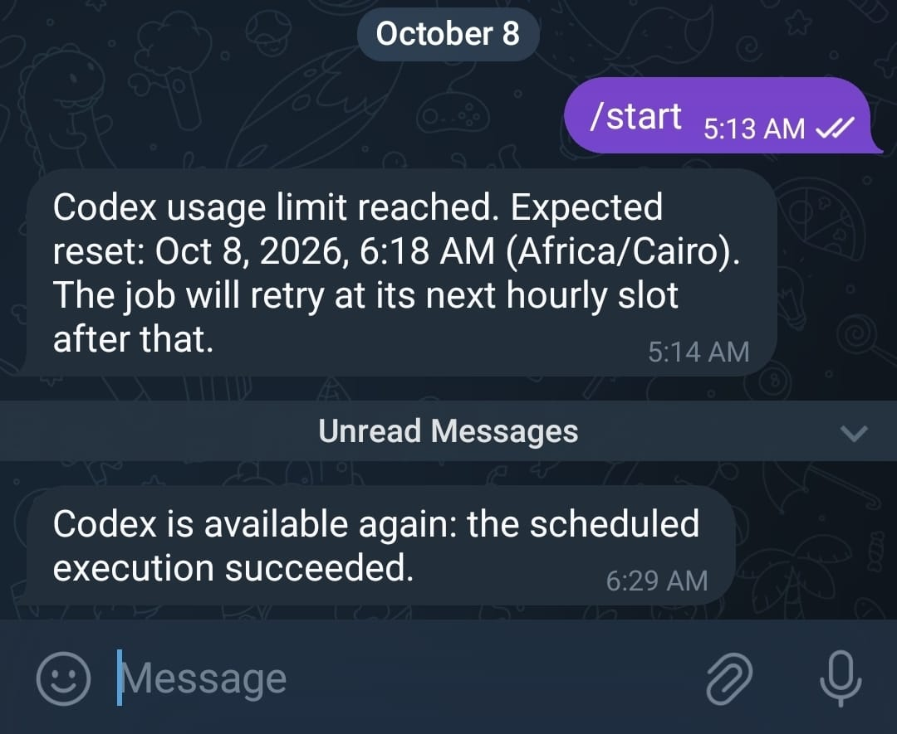

# Codex Retry Scheduler

A Node.js scheduler that runs the Codex CLI, detects usage-limit messages, reads the reset time from Codex's output, waits until that moment, and runs once more.

<p align="center">
  
  
  
</p>

## Overview

The scheduler automates one workflow:

1. Run Codex once with a small prompt.
2. If Codex reports a usage limit, read the reset time from its output.
3. Sleep until one minute after that reset time.
4. Run Codex again, then exit.

Every run is saved under `codex-results/`, and Telegram can notify you when the limit is hit and when service returns.

## Background: when the 5-hour window starts

Codex's usage window does not appear to start counting until the first prompt is sent. This means the time you send your first prompt sets when the window resets, not the time you actually started working.

The planned fix is a **warm-up**: a script sends one very cheap prompt to a low-cost model at a time you choose, so the window starts on your schedule. If you come back about two hours later, you use the remaining limit and wait less for the next reset than you would have otherwise.

The warm-up is **not implemented yet**. The scheduler only sends the probe prompt when you run it. See [Warm-up (planned)](#warm-up-planned).

## Features

- Native `.env` loading through Node's `--env-file` flag (no dependency needed)
- Retry at the reset time parsed from Codex output, not on a generic loop
- Clear handling of spawn errors, timeouts, and overlapping runs
- Per-run logs: prompt, raw JSON events, stderr, final reply, and a summary
- Persistent state in `codex-results/state.json`
- Telegram alerts for limit, reset, and recovery events
- `--status` and `--force` flags for inspection and manual override

## Requirements

- **Node.js 20.6 or newer** (needed for `--env-file`)
- The **Codex CLI** installed and signed in. Set its path in `CODEX_PATH`.
- A **project directory** that exists. Codex runs inside it. Set it in `CODEX_PROJECT`.
- Windows, macOS, or Linux. Paths in the examples are Windows paths.

## Quick start

1. Create your local environment file from the example:

   ```bash
   copy .env.example .env
   ```

2. Fill in your values:

   ```env
   CODEX_PATH="C:\Users\YourUser\AppData\Local\Programs\OpenAI\Codex\bin\codex.exe"
   CODEX_PROJECT="H:\codex limit"
   TELEGRAM_BOT_TOKEN=
   TELEGRAM_CHAT_ID=
   ```

   Telegram values are optional. Leave them empty to disable notifications.

3. Run the scheduler:

   ```bash
   npm start
   ```

Alternative direct run:

```bash
node --env-file=.env codex-scheduler.js
```

### `.env` path rules

`.env` values are read literally. Use **single** backslashes in Windows paths.

| Wrong (literal doubled backslashes or typos) | Right |
| --- | --- |
| `CODEX_PROJECT="H:\\codex limits"` | `CODEX_PROJECT="H:\codex limit"` |
| `CODEX_PATH="C:\\Users\\...\\codex.exe"` | `CODEX_PATH="C:\Users\...\codex.exe"` |

Quoting a value with `\\` does not unescape it. The scheduler checks both paths at startup and prints the exact value it read, so a typo shows up immediately.

## Scripts and flags

```json
"scripts": {
  "start": "node --env-file=.env codex-scheduler.js",
  "dev": "node --env-file=.env codex-scheduler.js",
  "status": "node --env-file=.env codex-scheduler.js --status",
  "test": "echo \"Error: no test specified\" && exit 1"
}
```

| Command | What it does |
| --- | --- |
| `npm start` / `npm run dev` | Runs one probe. If Codex hits a limit with a known reset time, waits and retries once. |
| `npm run status` | Prints the saved state (`codex-results/state.json`) and exits without running Codex. |
| `node --env-file=.env codex-scheduler.js --force` | Runs Codex even if the state says you are still paused. Use it only when you know the limit has reset. |

`npm test` is a placeholder. The project has no automated tests yet.

## Retry behavior

When Codex output matches a usage-limit message (for example "you've hit your usage limit" or "rate limit exceeded"), the scheduler looks for a reset time in this order:

1. An explicit timestamp in JSON output, such as `"resetsAt"`, `"resets_at"`, `"resetAt"`, or `"reset_at"` (epoch seconds, epoch milliseconds, or an ISO date).
2. A clock time in text, such as `try again at 6:18 AM`. This is interpreted in the configured timezone, using the next matching time.

If a reset time is found, the scheduler sleeps until **one minute after** it, runs once more, and exits. Example log:

```text
Usage limit resets at Oct 8, 2026, 6:18 AM (Africa/Cairo). Retrying at the exact reset time: Oct 8, 2026, 6:19 AM (Africa/Cairo).
```

If a limit is detected but no reset time can be parsed, the scheduler records `resetUnknown: true`, sends a Telegram notice, and exits with status `rate_limited` and a non-zero exit code. It does not retry on its own. Run it again later, or schedule it (see [Running on a schedule](#running-on-a-schedule)).

The wait happens inside the running process. If the process stops (sleep, closed terminal, reboot), the retry does not happen.

### Run statuses

| Status | Meaning |
| --- | --- |
| `success` | Codex finished without a usage limit. |
| `rate_limited` | Usage limit hit. Reset time may or may not be known. |
| `timeout` | Codex ran longer than `timeoutMs` (30 minutes) and was stopped. |
| `failed` | Codex exited with an error or could not start. |
| `skipped` | Another run was active, or the state says you are paused and `--force` was not used. |
| `scheduler_error` | An unexpected error in the scheduler itself. |

## Warm-up (planned)

The idea:

- A separate script (or a mode of this one) sends a very light prompt, for example `are you ready? answer with yes or no.`, to a low-effort model at a time you choose.
- That starts the usage window at a known time, instead of when your first real task arrives.
- Your real work then runs inside a window you already know the end of, and any wait for the next reset is shorter.

Current state: the probe prompt in `codex-scheduler.js` is sent only when you run the scheduler. Nothing sends a warm-up on its own yet.

Open design questions (good places to contribute):

- **Trigger:** a fixed time of day, an interval (for example every 5 hours from the last warm-up), or "first run after a long idle period"?
- **Scheduling:** an in-process timer, or an OS task (Windows Task Scheduler, cron) that calls `npm start`?
- **Model and effort:** which low-cost model and reasoning level are cheapest while still counting as a real request? The current `gpt-6-luna` setting only accepts `none`, `low`, `medium`, `high`, `xhigh`, or `max`.
- **Verification:** how do we confirm the window actually started? For example, by reading the reset time in the warm-up's response or by checking `state.json` afterward.

## Configuration

Settings are in the `CONFIG` object at the top of `codex-scheduler.js`:

| Key | Default | Notes |
| --- | --- | --- |
| `codexPath` | from `CODEX_PATH` | Native `codex.exe`, a `.cmd`/`.bat`/`.ps1` shim, or an npm `codex.js`. |
| `projectPath` | from `CODEX_PROJECT` | Must exist. Codex runs with this as its working directory. |
| `model` | `gpt-6-luna` | Passed to `codex exec -m`. |
| `reasoningEffort` | `low` | Must be a value the model accepts. |
| `prompt` | `are you ready? answer with yes or no.` | Sent on stdin. |
| `timezone` | `Africa/Cairo` | **Must match** the timezone in Codex's reset message. Change it in code if you are elsewhere. |
| `timeoutMs` | 30 minutes | Codex is killed after this long. |

## Files and output

Each run gets a folder under `codex-results/`, named by its start time and process ID:

- `prompt.txt`: the prompt sent
- `events.jsonl`: raw `--json` output from Codex
- `stderr.log`: error output
- `reply.md`: Codex's final message (or a placeholder if there was none)
- `result.json`: summary (status, times, exit code, reset time, model, effort)

Overall state is in `codex-results/state.json`:

- `rateLimited`, `pausedUntil`, `resetUnknown`: used to skip runs while paused
- `lastRun`: ID, status, and time of the most recent run

`codex-results/` is in `.gitignore`.

## Telegram notifications

If both `TELEGRAM_BOT_TOKEN` and `TELEGRAM_CHAT_ID` are set, the scheduler sends a message when:

- a usage limit is hit (with the expected reset time, if known)
- Codex is available again after a limit

<p align="center">
  
</p>

Telegram failures are logged and do not stop the run. Keep the bot token secret, and rotate it if it appears in logs or shared output.

## Running on a schedule

The scheduler is a one-shot process. For regular runs, use an OS scheduler:

- **Windows Task Scheduler:** run `npm start` from the project folder, set the start folder to the project path, and set the trigger you want.
- **macOS/Linux cron:** `cd /path/to/codex-limit && npm start`.

Keep the machine awake while the scheduler waits for a reset.

## Troubleshooting

| Error | Cause and fix |
| --- | --- |
| `Project directory does not exist: ...` | `CODEX_PROJECT` is wrong or has doubled backslashes. Use single backslashes. |
| `Codex path does not exist: ...` | `CODEX_PATH` is wrong. Find the real path with `where codex`. |
| `Found ..., but not ...codex.js` | You pointed at an npm shim whose package is missing. Point `CODEX_PATH` at `codex.exe` or the installed `codex.js`. |
| `Unsupported value: 'minimal' ... gpt-6-luna` | The reasoning effort is not supported by the model. Use `low`, `medium`, `high`, `xhigh`, `max`, or `none`. |
| `Skipping` / `Usage-limited until ...` | The state is paused. Wait for the reset, or run with `--force` once you know it has reset. |
| Run hangs for a long time | Codex is waiting or slow. It stops after `timeoutMs`. |

## Limitations

- No automated tests.
- The timezone is hard-coded in `CONFIG`.
- The reset-time parser depends on the message formats Codex currently uses. If the wording changes, `resetUnknown` is set and the run does not retry automatically.
- The wait is in-process; there is no built-in daemon or OS scheduler integration.
- Warm-up is not implemented (see above).

## Contributing ideas

Ideas welcome, especially:

- the warm-up mode and trigger design above
- a `--dry-run` that prints the next retry time without running Codex
- tests for the reset-time parser (the most fragile part)
- a timezone option in `.env`
- automatic re-try when `resetUnknown` is set, with a bounded interval

---

Built for reliable Codex retry scheduling with exact reset timing.
